# 9 Enterprises — Full System Dependency Map

**Generated:** 2026-04-05
**Author:** Tee (Engineering Team Lead)
**Version:** 2.0.0 (canonical — supersedes 2026-03-26 version)
**Verification:** All claims verified against live running code, process list, and LaunchAgent plists. No memory-file speculation.

---

## Quick Reference — Live Process Inventory

| Process | Script | Port | PID (audit) | LaunchAgent | Status |
|---------|--------|------|-------------|-------------|--------|
| comms-hub | `scripts/comms-hub.mjs` | 3457 | 67516 | com.9.comms-hub | LIVE |
| voice-server | `scripts/voice-server.mjs` | 3456 | 67769 | com.9.voice-server | LIVE |
| cloudflared | system binary | — | 67753 | none (spawned) | LIVE |
| jules-telegram | `scripts/jules-telegram.mjs` | — | 3346 | none | LIVE (manual) |
| kids-mentor | `scripts/kids-mentor.mjs` | — | 1163 | none | LIVE (manual) |
| trader9-bot | `scripts/trader9-bot.mjs` | — | 4932 | none | LIVE (manual) |
| pilot-server | `scripts/pilot-server.mjs` | 3472 | 16756 | com.9.pilot-server | LIVE |
| trinity-agent | `scripts/trinity-agent.mjs` | — | 74282 | none | LIVE (manual) |
| underwriter-api | `scripts/underwriter-api.mjs` | 3471 | 71624 | none | LIVE (manual) |
| open-terminal | `scripts/open-terminal.mjs` | — | 12147, 12148 | com.9.terminal-opener | LIVE (2 instances) |
| health-monitor | `scripts/health-monitor.mjs` | 3458 | — | com.9.health-monitor | NOT RUNNING |

---

## Mermaid Dependency Graph

```mermaid
graph TD
    %% External Services
    ANT["Anthropic Claude API\napi.anthropic.com"]
    TG["Telegram Bot API\napi.telegram.org"]
    TW["Twilio\nSMS + Voice"]
    EL["ElevenLabs TTS\napi.elevenlabs.io"]
    SUP["Supabase\nCloud DB mirror"]
    NEON["Neon\nPostgreSQL backup"]
    ALPACA["Alpaca Markets\nTrading API"]
    GH["GitHub Pages\nainflgm.com hosting"]
    OTC["Over The Cap\nNFL data scrape"]
    OWM["OpenWeatherMap\nWeather API"]
    CF["Cloudflare Workers\nEdge deploy"]

    %% Mac Hardware SPOF
    MAC["MacBook Pro\nSINGLE POINT OF FAILURE\nAll processes die on crash"]

    %% Data Stores
    SQLITEDB["data/9-memory.db\nSQLite WAL\nMessages, actions, tasks, decisions"]
    IMSGDB["Library/Messages/chat.db\nApple Messages DB\nRead-only, requires FDA"]
    SHAREDSTATE["scripts/shared-state.json\nIn-process state"]
    KYLEC_PROFILE["data/jules-profile-kylec.json"]
    JASSON_PROFILE["data/jules-profile-jasson.json"]
    BENGAL_MEM["data/bengal-pro-memory.txt"]
    CF_KV["Cloudflare KV: STATE\nHeartbeat + sync"]

    %% Core Infrastructure
    HUB["comms-hub.mjs\nPort 3457\nCentral orchestrator"]
    VS["voice-server.mjs\nPort 3456\nTwilio voice webhook"]
    TUNNEL["cloudflared\nEphemeral tunnel\nExposes port 3456"]
    OT["open-terminal.mjs\nLaunchAgent\nSignal watcher"]
    HM["health-monitor.mjs\nPort 3458\nNOT RUNNING"]
    MDB["memory-db.mjs\nLibrary — SQLite wrapper"]

    %% Product Services
    JULES["jules-telegram.mjs\nPersonal assistant\nJasson Telegram"]
    KIDS["kids-mentor.mjs\nBengal Pro\niMessage group chat"]
    T9["trader9-bot.mjs\nAlgorithmic trading\nAlpaca paper+live"]
    TRIN["trinity-agent.mjs\nDiscovery agent\n15-min scan cycle"]
    PILOT["pilot-server.mjs\nPort 3472\nFreeAgent9 pilot\nKyle Cabezas SMS"]
    UW["underwriter-api.mjs\nPort 3471\nMortgage QandA\nNO AUTH"]

    %% Products not running
    AINFLGM["ainflgm.com\nReact Vite SPA\nGitHub Pages"]
    CLOUD["cloud-worker\nBackup QB\nNOT DEPLOYED"]
    CMDHUB["command-hub\nNext.js dashboard\nBUILT NOT SERVING"]

    %% Mac as root dependency
    MAC --> HUB
    MAC --> VS
    MAC --> JULES
    MAC --> KIDS
    MAC --> T9
    MAC --> TRIN
    MAC --> PILOT
    MAC --> UW
    MAC --> OT
    MAC --> HM

    %% Hub dependencies
    HUB --> ANT
    HUB --> TG
    HUB --> TW
    HUB --> SUP
    HUB --> NEON
    HUB --> MDB
    HUB --> SHAREDSTATE
    HUB --> IMSGDB
    MDB --> SQLITEDB

    %% Hub watches / controls
    HUB -.->|watchdog port 3458| HM
    HUB -.->|writes signal file| OT
    HUB -.->|state sync push| CLOUD

    %% Voice server dependencies
    VS --> ANT
    VS --> EL
    VS --> TW
    VS --> TUNNEL
    TUNNEL -.->|exposes port 3456| TW

    %% Agent dependencies
    JULES --> ANT
    JULES --> TG
    JULES --> JASSON_PROFILE

    KIDS --> ANT
    KIDS --> IMSGDB
    KIDS --> BENGAL_MEM

    T9 --> ALPACA
    T9 -.->|trade notifications| HUB

    TRIN --> ANT
    TRIN -.->|context updates| HUB

    PILOT --> ANT
    PILOT --> TW
    PILOT --> OWM
    PILOT --> KYLEC_PROFILE

    UW --> ANT

    %% Product pipelines
    AINFLGM --> GH
    AINFLGM --> OTC

    CLOUD --> ANT
    CLOUD --> TG
    CLOUD --> CF_KV
    CLOUD --> CF

    CMDHUB --> SUP
```

---

## Component Details

---

### 1. Comms Hub

**Script:** `scripts/comms-hub.mjs`
**Port:** 3457
**LaunchAgent:** com.9.comms-hub (auto-restarts on crash)
**Status:** LIVE (PID 67516)

Central message router for the entire 9 system. Manages all 4 communications channels simultaneously. Switches between relay mode (terminal active) and autonomous OC mode (terminal absent, Sonnet responds). Contains freeze watchdog, proactive terminal recovery, Supabase/Neon sync, and API health probing.

**Runtime dependencies (npm):**
- `dotenv` — .env loading
- `nodemailer` — Gmail SMTP send
- `pg` — Neon PostgreSQL connection
- `@supabase/supabase-js` — Supabase cloud mirror
- `./memory-db.mjs` — SQLite persistence layer (local import)

**Node built-ins:** `child_process`, `fs`, `https`, `path`, `http`, `net`

**External API calls:**

| Service | Purpose | Criticality |
|---------|---------|-------------|
| Anthropic (`api.anthropic.com`) | Autonomous OC responses + API health probe | CRITICAL |
| Telegram Bot API | Primary inbound/outbound channel | CRITICAL |
| Twilio | iMessage bridge, SMS | HIGH |
| Gmail SMTP (`smtp.gmail.com:587`) | Email send channel | MEDIUM |
| Supabase | Cloud message/action mirror | MEDIUM |
| Neon (PostgreSQL) | Secondary cloud backup | LOW |
| Cloudflare Worker (`CLOUD_WORKER_URL`) | State sync push | LOW |

**Credentials required:**
`ANTHROPIC_API_KEY_TC`, `TELEGRAM_BOT_TOKEN`, `TELEGRAM_CHAT_ID`, `TWILIO_ACCOUNT_SID`, `TWILIO_AUTH_TOKEN`, `JASSON_PHONE`, `JAMIE_PHONE`, `GMAIL_APP_PASSWORD`, `NEON_DATABASE_URL`, `SUPABASE_URL`, `SUPABASE_ANON_KEY`, `HUB_API_SECRET`, `CLOUD_SECRET`, `CLOUD_WORKER_URL`, `JULES_KYLEC_RECIPIENT_PHONE`

**Data stores:**
- `data/9-memory.db` — SQLite, all messages/actions/decisions/tasks (R/W)
- `scripts/shared-state.json` — in-process crash-survivable state (R/W)
- `~/Library/Messages/chat.db` — Apple Messages read (R/O, requires FDA)
- `logs/comms-hub.log` — append-only (W)
- `logs/oc-violations.log` — OC impersonation events (W)

**Temp files:**
`/tmp/tc-agent-offset.txt`, `/tmp/9-session-token`, `/tmp/9-terminal-pid`, `/tmp/9-last-tool-call`, `/tmp/9-open-terminal`, `/tmp/9-incoming-message.jsonl`, `/tmp/telegram_photo_*.jpg`, `/tmp/telegram_doc_*`

**Reverse dependencies (what depends on comms-hub):**
- voice-server — watchdogged, restarted if port 3456 unreachable
- health-monitor — watchdogged on port 3458
- open-terminal — hub writes the `/tmp/9-open-terminal` signal
- trader9-bot — sends trade notifications to hub `/send`
- trinity-agent — posts context updates to hub `/context`
- cloud-worker — receives state pushes from hub

---

### 2. Voice Server

**Script:** `scripts/voice-server.mjs`
**Port:** 3456
**LaunchAgent:** com.9.voice-server
**Status:** LIVE (PID 67769)

Twilio voice webhook receiver. Converts incoming calls into Claude API conversations with ElevenLabs TTS responses. Context-aware per caller (Jasson, Jamie, Kyle, etc). Sentence-boundary streaming for low latency. All audio buffered in `/tmp/voice_audio/`.

**Runtime dependencies (npm):** none (uses only Node built-ins)

**External API calls:**

| Service | Purpose | Criticality |
|---------|---------|-------------|
| Anthropic (`api.anthropic.com`) | Voice response generation | CRITICAL |
| ElevenLabs (`api.elevenlabs.io`) | Text-to-speech conversion | HIGH |
| Twilio | Webhook receiver (inbound calls) | HIGH |
| cloudflared tunnel | Exposes port 3456 publicly | HIGH |

**Credentials required:**
`ANTHROPIC_API_KEY`, `ELEVENLABS_API_KEY`, `ELEVENLABS_VOICE_ID`, `TWILIO_AUTH_TOKEN`, `TUNNEL_URL`

**Data stores:**
- `/tmp/voice_audio/` — ephemeral MP3 files (R/W)
- `/tmp/call-transcript-latest.txt` — latest call transcript (W)

**Critical dependency note:** cloudflared tunnel URL is ephemeral. Every restart generates a new subdomain. Twilio voice webhook URL must be manually updated after each restart.

---

### 3. Jules (Telegram — Jasson personal assistant)

**Script:** `scripts/jules-telegram.mjs`
**Port:** none (polling-based)
**LaunchAgent:** none
**Status:** LIVE — manually started (PID 3346)

Personal AI assistant for Jasson via separate Telegram bot. Polling at 2-second intervals. Uses Haiku by default, escalates to Sonnet/Opus on complex requests. Maintains persistent JSON profile.

**Credentials required:**
`JULES_TELEGRAM_BOT_TOKEN`, `ANTHROPIC_API_KEY`

**Data stores:** `data/jules-profile-jasson.json` (R/W)

**Security note:** Bot token visible as hardcoded fallback in source — should be env-var only.

---

### 4. Kids Mentor / Bengal Pro

**Script:** `scripts/kids-mentor.mjs`
**Port:** none
**LaunchAgent:** none
**Status:** LIVE — manually started (PID 1163)

AI mentor for Duke (11) and Jude (8) via iMessage group chat "Dumbasses". Reads Messages DB, builds web projects, deploys HTML to sandboxed paths. Sandbox enforcement locks writes to `dist/duke/` and `dist/jude/`.

**Credentials required:** `ANTHROPIC_API_KEY`

**Data stores:**
- `~/Library/Messages/chat.db` (R/O — requires FDA)
- `data/bengal-pro-memory.txt` (R/W)
- `dist/duke/`, `dist/jude/` (W — sandboxed)
- `public/duke/`, `public/jude/` (W — deployed to ainflgm.com)

---

### 5. Trader9

**Script:** `scripts/trader9-bot.mjs`
**Port:** none
**LaunchAgent:** none
**Status:** LIVE — manually started (PID 4932)

Multi-asset trading bot. 8-strategy ensemble. 5-minute cycle. Paper account active ($333). Live trading enabled if `ALPACA_LIVE_API_KEY` is set. Sends trade notifications to comms-hub.

**Credentials required:**
`ALPACA_API_KEY`, `ALPACA_SECRET_KEY`, `ALPACA_LIVE_API_KEY` (optional), `ALPACA_LIVE_SECRET_KEY` (optional)

**Data stores:**
- `logs/trader9.log` (W)
- `data/trader9-halt-until.txt` — circuit breaker (R/W)
- `/tmp/trader9-status.txt` (W)

**Risk note:** Live trading credentials present in .env. Not in LaunchAgent — crash silently stops all trading.

---

### 6. Trinity Agent

**Script:** `scripts/trinity-agent.mjs`
**Port:** none
**LaunchAgent:** none
**Status:** LIVE — manually started (PID 74282)

Autonomous discovery agent. 15-minute scan cycle. Haiku for scans, Sonnet for deep evaluations. Posts findings to comms-hub `/context`. Output is internal-only (not sent to Telegram per April 1 directive).

**Credentials required:** `ANTHROPIC_API_KEY`

**Data stores:**
- `logs/trinity.log` (W)
- `logs/trinity-findings.json` (R/W)

---

### 7. Pilot Server / FreeAgent9

**Script:** `scripts/pilot-server.mjs`
**Port:** 3472
**LaunchAgent:** com.9.pilot-server
**Status:** LIVE (PID 16756)

Personal assistant for Kyle Cabezas (Rapid Mortgage Cincinnati). SMS via Twilio. Weather briefings. Twilio HMAC-SHA1 webhook validation correctly implemented. Single pilot user.

**Credentials required:**
`ANTHROPIC_API_KEY`, `TWILIO_ACCOUNT_SID`, `TWILIO_AUTH_TOKEN`, `TWILIO_PHONE_NUMBER`, `JULES_KYLEC_RECIPIENT_PHONE`, `OPENWEATHER_API_KEY`

**Data stores:**
- `data/jules-profile-kylec.json` (R/W)
- `logs/freeagent-security.log` (W)

---

### 8. AI Underwriter

**Script:** `scripts/underwriter-api.mjs`
**Port:** 3471
**LaunchAgent:** none
**Status:** LIVE — manually started (PID 71624)

Mortgage guideline Q&A. FHA, Conventional, VA, Jumbo. Reads markdown files as RAG context. NO authentication on any endpoint.

**Credentials required:** `ANTHROPIC_API_KEY`

**Data stores (read-only):**
- `mortgage-ai/fannie-mae-guidelines.md`
- `mortgage-ai/fha-guidelines.md`
- `mortgage-ai/freddie-mac-differences.md`
- `mortgage-ai/va-usda-guidelines.md`

**CRITICAL: No authentication. No rate limiting. One accidental tunnel exposure = fully open API.**

---

### 9. Health Monitor

**Script:** `scripts/health-monitor.mjs`
**Port:** 3458
**LaunchAgent:** com.9.health-monitor (plist exists)
**Status:** NOT RUNNING at audit time

Polls all services 30s fast / 5m slow. Logs to `health_events` SQLite table. Deduplicates alerts within 5-minute window. Alerts via comms-hub. Comms-hub watchdogs this and logs "health monitor down" when unreachable.

---

### 10. Open Terminal

**Script:** `scripts/open-terminal.mjs`
**Port:** none
**LaunchAgent:** com.9.terminal-opener
**Status:** LIVE — two instances (PIDs 12147, 12148)

Watches `/tmp/9-open-terminal` signal file. Opens Terminal.app and runs `claude` command. 3x retry with backoff. Two instances running — potential race condition on signal file consumption.

---

### 11. Memory Database (library)

**Script:** `scripts/memory-db.mjs`
**Type:** Imported library — not standalone process

SQLite persistence layer. Prefers `better-sqlite3-multiple-ciphers` (SQLCipher). Falls back to `better-sqlite3`. WAL mode, foreign keys enabled. 8 tables. Supabase sync hooks injected by comms-hub post-import.

**Credentials:** `SQLITE_ENCRYPTION_KEY` (optional — controls SQLCipher encryption)

---

### 12. AiNFLGM (ainflgm.com)

**Type:** Product — static React SPA
**Build tool:** Vite 8
**Deploy:** GitHub Pages via GitHub Actions on push to main
**Status:** LIVE

NFL offseason simulator. Data refreshed 2x/day via `data-refresh.yml` workflow (scrapes OTC, rebuilds). Fully static — no backend, minimal attack surface.

**Build dependencies:** `react`, `react-dom`, `react-router-dom`, `vite-plugin-pwa`

**CI/CD:** `deploy.yml` (push-triggered), `data-refresh.yml` (cron 0 10 and 0 22 UTC daily)

---

### 13. Cloud Worker (Backup QB)

**Script:** `cloud-worker/src/worker.js`
**Runtime:** Cloudflare Workers
**Status:** BUILT — NOT DEPLOYED

Always-on cloud backup for when Mac is down. Handles Telegram. KV for heartbeat and state. Cron every 2 minutes. NOT deployed — `deploy.sh` has not been run.

**Credentials (Cloudflare Worker secrets):**
`ANTHROPIC_API_KEY`, `TELEGRAM_BOT_TOKEN`, `CLOUD_SECRET`

---

### 14. Command Hub (Dashboard)

**Script:** `command-hub/` (Next.js 16, TypeScript)
**Status:** BUILT — NOT SERVING

Admin dashboard. Connects to Supabase for real-time data. Never deployed to any hosting target. No authentication layer defined.

---

## LaunchAgents Inventory

| Label | Script | KeepAlive | Notes |
|-------|--------|-----------|-------|
| com.9.comms-hub | `scripts/comms-hub.mjs` | Yes | Core — restarts within seconds |
| com.9.voice-server | `scripts/voice-server.mjs` | Yes | Restart changes tunnel URL |
| com.9.pilot-server | `scripts/pilot-server.mjs` | Yes | FreeAgent9 pilot |
| com.9.terminal-opener | `scripts/open-terminal.mjs` | Yes | Signal file watcher |
| com.9.health-monitor | `scripts/health-monitor.mjs` | Yes | Plist exists, not running at audit |
| com.9.memory-archive | `scripts/memory-archive.mjs` | Unknown | Not verified live |
| com.9.memory-autocommit | `scripts/memory-autocommit.sh` | Unknown | Not verified live |
| com.9.freeze-watchdog | `scripts/freeze-watchdog.sh` | Yes | Detects frozen Claude sessions |
| com.9.claude-watchdog | `scripts/claude-watchdog.sh` | Yes | Watches Claude Code process |

**Services NOT in LaunchAgent (no auto-restart on crash):**
`jules-telegram.mjs`, `kids-mentor.mjs`, `trader9-bot.mjs`, `trinity-agent.mjs`, `underwriter-api.mjs`

---

*Credential hygiene: `docs/credential-inventory.md`*
*Critical path chains: `docs/dependency-map-critical-path.md`*
*Machine-parseable: `docs/dependency-map.json`*
